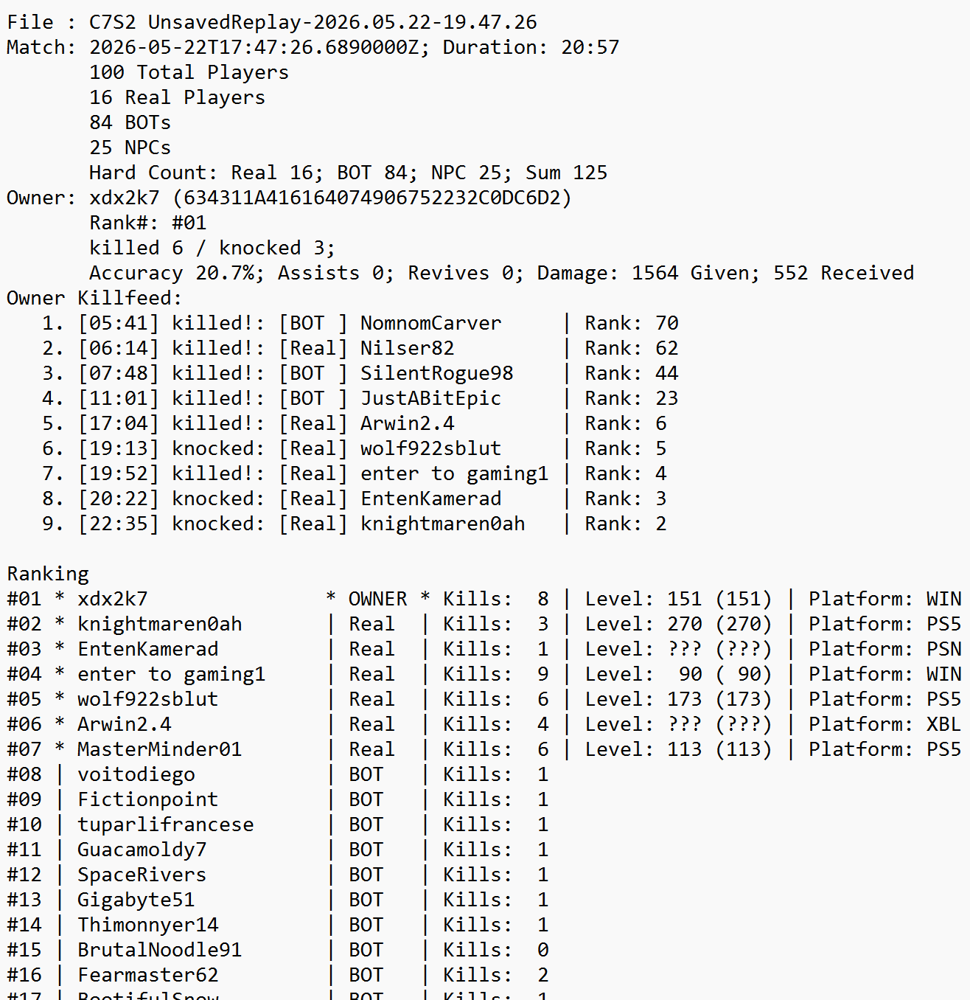

# PLAY.PARSE.ANALYZE.REPEAT<br/>Fortnite.Replay.Decompressor

<b>Standalone .NET Replay Parser And Analyzer For Fortnite Replays (*.replay)</b>

This project was originally forked from [Shiqan/FortniteReplayDecompressor](https://github.com/Shiqan/FortniteReplayDecompressor). The original parser and replay model code still come from that codebase. On top of it, this fork adds a text/JSON export pipeline and console tooling that writes analysis artifacts for each replay.

## What this fork adds

- JSON export for each parsed replay
- Human-readable TXT analysis output
- Owner and ranking analysis
- Kill feed summary and replay stats
- Default output written to `REPLAYS/PARSED`
- Optional long-running replay watcher (`ReplayWatcher`) for automatic parsing after a match finishes

Screenshot:



## Requirements

- .NET SDK 10.0 or newer
- Windows PowerShell or a terminal capable of running `dotnet`

If you need to install the SDK on Windows, the quickest path is:

```powershell
winget install --id Microsoft.DotNet.SDK.10 --exact
```

## Build

Run from repository root:

```powershell
dotnet restore
dotnet build -c Release
```

## Run on replays

Run from repository root.

Parse a single replay file:

```powershell
dotnet run --project .\src\ConsoleReader\ConsoleReader.csproj -c Release -- .\REPLAYS\YourReplay.replay
```

Parse a folder of replay files:

```powershell
dotnet run --project .\src\ConsoleReader\ConsoleReader.csproj -c Release -- .\REPLAYS
```

The exporter writes these files under `REPLAYS/PARSED` by default:

- `<replay-name>.json`
- `<replay-name>.txt`

Optional flags:

- `--quiet`: suppresses diagnostics in console output
- `--output-root <path>`: custom output directory

## Auto watch new replays (ReplayWatcher)

`ReplayWatcher` is a dedicated .NET console app that keeps running until you close it (or press `Ctrl+C`). It scans for new `*.replay` files, waits until files are stable, then writes both JSON and TXT and prints a summary to console.

Default watch directory:

- `%LOCALAPPDATA%\FortniteGame\Saved\Demos`

Run from repository root:

```powershell
dotnet run --project .\src\ReplayWatcher\ReplayWatcher.csproj -c Release
```

Common options:

- `--dir <path>`: custom replay directory
- `--output-subdir <name>`: subfolder inside watched replay directory (default: `PARSED`)
- `--scan-interval <seconds>`: polling interval in seconds (default: `2`)
- `--process-existing`: also process already existing replay files on startup

Examples:

```powershell
# Watch repository REPLAYS folder and write to REPLAYS\PARSED
dotnet run --project .\src\ReplayWatcher\ReplayWatcher.csproj -c Release -- --dir .\REPLAYS

# Process existing files too
dotnet run --project .\src\ReplayWatcher\ReplayWatcher.csproj -c Release -- --dir .\REPLAYS --process-existing
```

## Build standalone EXE

From repository root:

```powershell
& "C:\Program Files\dotnet\dotnet.exe" publish .\src\ReplayWatcher\ReplayWatcher.csproj -c Release -r win-x64 --self-contained true /p:PublishSingleFile=true /p:IncludeNativeLibrariesForSelfExtract=true -o .\dist\ReplayWatcher
```

Published executable:

- `dist\ReplayWatcher\ReplayWatcher.exe`

Run it directly:

```powershell
.\dist\ReplayWatcher\ReplayWatcher.exe
```

## Troubleshooting

- Replay directory not found (Watcher):
	- If `%LOCALAPPDATA%\FortniteGame\Saved\Demos` does not exist yet, the watcher keeps running and waits.
	- Start Fortnite once and finish a match so the folder gets created, or pass a custom folder with `--dir <path>`.
- No output files are written:
	- Ensure your input path points to a real `*.replay` file or a folder containing replay files.
	- By default, exports are written to `REPLAYS/PARSED` (or `<watch-dir>/<output-subdir>` in watcher mode).
	- You can force a custom output directory with `--output-root <path>`.
- File access errors while a replay is being written:
	- Replays may still be locked by Fortnite while recording.
	- Wait a few seconds and retry; `ReplayWatcher` retries automatically after files become stable.
- Build or run fails with missing SDK/runtime:
	- Check your SDK version with `dotnet --info`.
	- Install/update .NET 10 SDK: `winget install --id Microsoft.DotNet.SDK.10 --exact`.

## Notes

- Parser/model logic is based on the original .NET implementation.
- Console tools add reporting and export behavior on top.
- TXT output is formatted for scanability and intended to stay stable over time.


